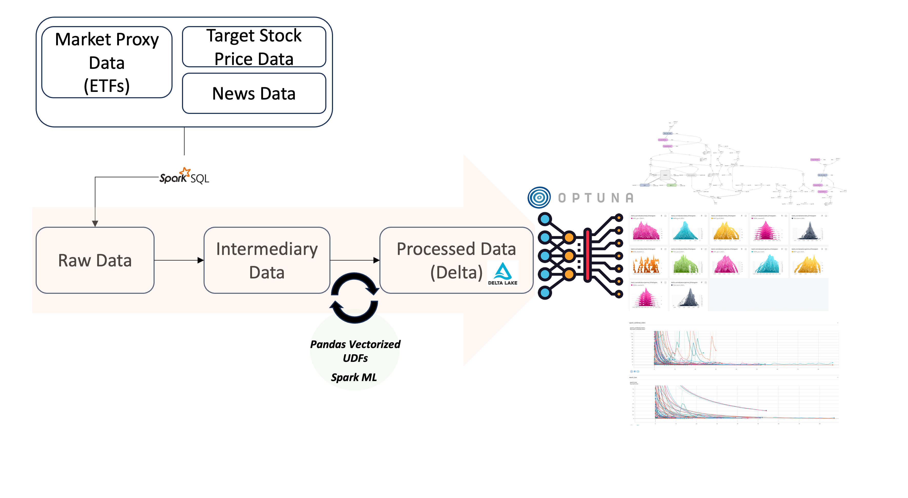
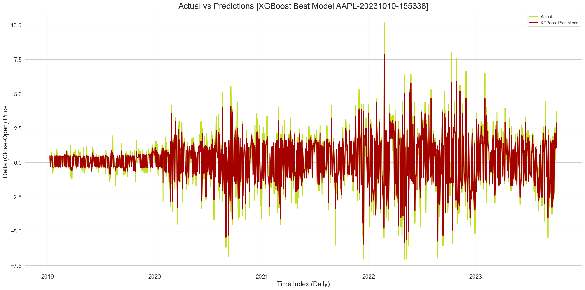
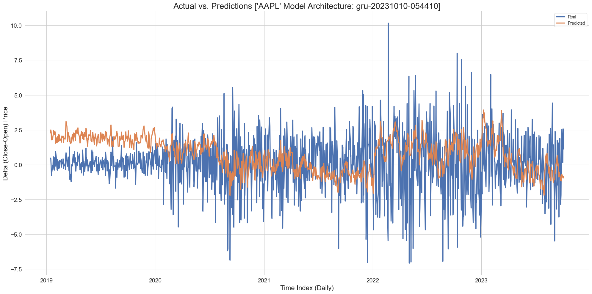
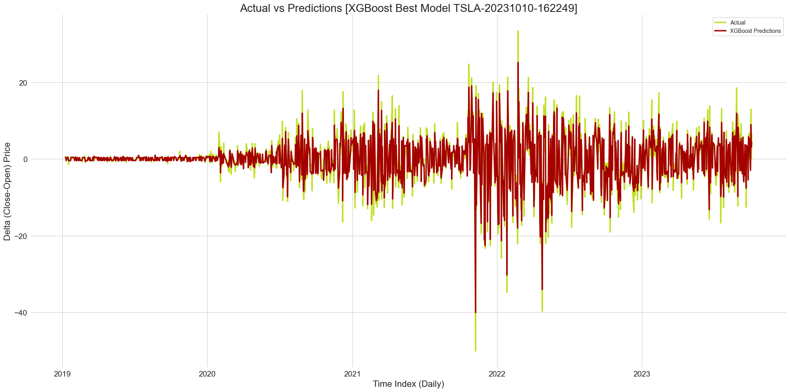
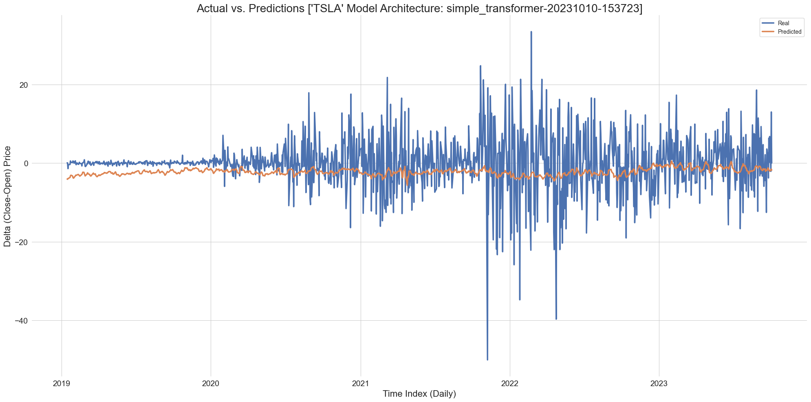

# Spark Vectoized UDF Pipleline & Data Science

## Overview
Stock price data collation and analysis available on the internet usually is just focused on datasets which can fit on one singular machine. 

This is a mini-project which utilizes Pandas vectorized UDFs as the core element to create a data pipeline for stock price data which can be scaled for big data and distributed computing. Additional SparkML tools are used to vectorize and embed text data into the dataset. 

The data science component uses the procesed dataset and Optuna for hyperparameter optimization. XGBoost yielded the best results, but various RNN, CNN and stacked neural network models were also tested with Optuna. 

Though XGBoost did yield some surprisingly good results, the purpose of this project wasn't in model accuracy, but in working with both the engineering and science components of data in tandem with financial domain knowledge to see the A to Z of data and structure code in a way which could be used for web apps. 

## Technologies
- **Languages:** Python
- **Modules/Libraries:** PySpark (SparkSQL, SparkML), Pandas, TA-Lib, Optuna, Tensorflow(Keras), XGBoost, Boto3
- **Services:** AWS S3, Delta Lake

## Workflow/Architecture


## Key Features Used
### Technical Features (Using Vectorized UDFs & Pandas TA-Lib)
1. **Williams %R**: Momentum indicator that measures overbought/oversold levels. The values range from -100 to 0.
2. **Stochastic Oscillator (K%)**: Measures where the closing price is relative to the high-low range over a certain number of days.
3. **Rate of Change (ROC)**: Measures the percentage change in price from one period to the next.
4. **Commodity Channel Index (CCI)**: An oscillator that measures the difference between the current price and the historical average price.
5. **Average Directional Index (ADX)**: Measures the strength of a trend in a price series.
6. **Average True Range (ATR)**: Measures market volatility by decomposing the entire range of an asset price for that period.
7. **20-day Exponential Moving Average (20D-EMA)**: A smoothed average of prices, with more weight given to recent prices.
8. **50-day Exponential Moving Average (50D-EMA)**: Similar to the 20D-EMA, but considers a longer price history.
9. **100-day Exponential Moving Average (100D-EMA)**: Considers an even longer price history.
10. **Bollinger Bands**: Include three lines (bands) – a moving average (middle band), an upper band, and a lower band. Used to measure the volatility of the market.
11. **Volume Weighted Average Price (VWAP)**: Represents the average price a stock has traded at throughout the day, based on both volume and price.
12. **Price minus VWAP**: Represents the difference between the closing price and the VWAP.
13. **Relative Strength Index (RSI)**: Measures the speed and change of price movements and indicates overbought or oversold conditions in an asset.
14. **RSI Category**: Categorizes RSI values into bins to identify the strength and condition of the asset.
15. **MACD Signal Line (MACDs_12_26_9)**: A smoothed version of the MACD line, used for triggering buy/sell signals.
16. **MACD Histogram (MACDh_12_26_9)**: Represents the difference between the MACD line and the Signal line, indicating the strength of the movement.
17. **Positive Directional Movement (DMP_16)**: Represents the positive movement direction over a specified period.

### Embedded Features
1. **Historic News Article Titles**: News article titles sorted by target underlying asset ticker symbol
2. **Historic News Article Descriptions**: News article descriptions sorted by target underlying asset ticker symbol
3. **Historic News Article Keywords**: News article keywords sorted by target underlying asset ticker symbol

- News features were curated using Polygon.io API. They were then processed using SparkML (Tokenization, Embedding using Word2Vec)

## Categorial Features
1. **Day of Week**: Represents which day of the week the data corresponds to.
2. **Month**: Extracted from the timestamp, represents the month.
3. **Quarter**: Extracted from the timestamp, represents the quarter of the year.

## Others
1. **Rolling Averages**: Standard deviation, mean
2. **Lags**: Number of transactions, weighted volume

## Results
- Vectorized UDFs were indeed performant. Applying the transformations in chunks outweighed any manual attept using Pyspark, or transferring the DataFrame to Pandas to perform calculations and then re-transferring back to Spark in chunks.
- XGBoost yielded the best models for all tested assets given the current features, but local machine power limited the extensive training of deep learning models which could be further optimized using the setup. 
- Output images and models can be found under `data_science/images` `data_science/models`
- Tensorboard logs and custom XGBoost output logs generated by Optuna can be found under `data_science/logs`

### Sample Output for best model using custom logging and Optuna (Google)
```
++++++++++++++++++++++++++++++++++++++++++++++++++++++++++++
[GOOGL-20231010-160345] XGBoost Best Model
Number of finished trials:1000
++++++++++++++++++++++++++++++++++++++++++++++++++++++++++++
Best trial:
------------------------------------------------------------
RMSE Val: 0.2853333740469398
Best Model RMSE: 0.4515955499939841
Best Model MAE: 0.3568165843986159
Best Model R2 Score: 0.9113707992078159
Best Model Median Absolute Error: 0.3060603141784668
------------------------------------------------------------
Hyperparameters
------------------------------------------------------------
    booster: gbtree
    lambda: 8.363589782502928e-13
    alpha: 0.08522620078244944
    subsample: 0.8190691396219996
    colsample_bytree: 0.7180603020926846
    colsample_bylevel: 0.662502428857981
    colsample_bynode: 0.10045576557567937
    max_depth: 45
    min_child_weight: 8
    eta: 0.9963019530287398
    gamma: 1.9797660912711739
    grow_policy: lossguide
    scale_pos_weight: 551.2408560311256
    tree_method: approx
============================================================
```

### XGBoost best model vs. Deep Learning best model sample (Apple, Tesla)






## To Setup
- Was built on Python 3.10.12
- Requires a Polygon.io API Key. You can get one free here with a signup: (https://polygon.io/)
    - Note: For the free API key, you can only get 2 years worth of price data and the news API is not available
    - I have made adjustments in the data engineering code to catch this in the data ingestion, but preprocessing steps need to be adjusted (`data_engineering/2_silver_layer.py` and `data_engineering/3_gold_layer.py`)
- Requires a AWS S3 bucket. 
    - For quick terraform setup refer to my other project (https://github.com/iamwonseokchoi/alpha_lakehouse) under `s3_data_lake`
    - This project simply uses `boto3` instead of `s3fs` for ease of access so no ACL access list setup is needed on the AWS side (You just need to generate a AWS key and secret key)

1. Create a `.env` file in root directory
```
~$ touch .env
```
2. Fill these environment variables inside `.env`
```
TICKERS = ["AAPL", "AMZN", "GOOGL", "MSFT", "NVDA", "TSLA"] 
# You can add to this as you please but market proxy ETFs are only geared for US stocks

POLYGON_API_KEY = <YOUR KEY>

AWS_ACCESS_KEY = <YOUR KEY>
AWS_ACCESS_KEY_SECRET = <YOUR BUCKET>
S3_BUCKET = <YOUR BUCKET>
S3_BASE_PATH = <YOUR BUCKET BASE URI>   # ex: "s3a://my-bucket"
```
3. Run ETL to ingest and process data on S3
```
~$ chmod +x ./data_engineering/etl.sh

~$ ./data_engineering/etl.sh
```

4. Can now run and test the data science portions under `data_science/notebooks/*`

**E.O.D**